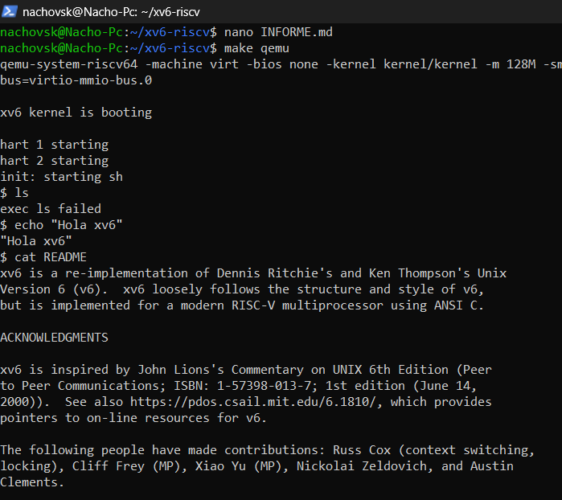

# INFORME Tarea 0 - Instalación de xv6

# IGNACIO VIDAL

## Pasos seguidos
1. Realicé un **fork** del repositorio oficial de xv6 (`https://github.com/mit-pdos/xv6-riscv`) a mi cuenta de GitHub para poder trabajar sobre mi copia.
2. Cloné mi fork en WSL/Ubuntu en la carpeta `~/xv6-riscv`.
3. Creé mi **rama personal** `vidal_t0` para trabajar de manera independiente sin afectar la rama principal.
4. Verifiqué dependencias necesarias en WSL/Ubuntu.
5. Instalé los paquetes requeridos para compilar xv6 y ejecutar QEMU.
6. Compilé xv6 con `make`.
7. Ejecuté xv6 en QEMU con `make qemu`.
8. Probé los comandos básicos dentro de xv6:
   - `ls`
   - `echo "Hola xv6"`
   - `cat README`

> Nota: Al inicio tuve dificultades con la configuración de Git y la conexión con mi fork usando SSH, lo que me tomó un poco de tiempo resolver, pero finalmente logré autenticarme correctamente y trabajar sobre mi rama.

## Problemas encontrados y soluciones (con ayuda de ChatGPT)
- **Error de compilación:** `Couldn't find a riscv64 version of GCC/binutils`. 
  **Solución:** Instalé `gcc-riscv64-unknown-elf` y `binutils-riscv64-unknown-elf`.
- **Error con QEMU:** `qemu-system-riscv64: not found`. 
  **Solución:** Instalé `qemu-system-misc`.
- **Configuración de GitHub/SSH:** Problemas iniciales al autenticar la rama en mi fork. 
  **Solución:** Generé clave SSH, la agregué a GitHub y configuré correctamente el remoto a mi fork.

## Confirmación
Xv6 funciona correctamente. La captura de pantalla adjunta muestra la ejecución de los comandos `ls`, `echo "Hola xv6"` y `cat README`.

## Captura

